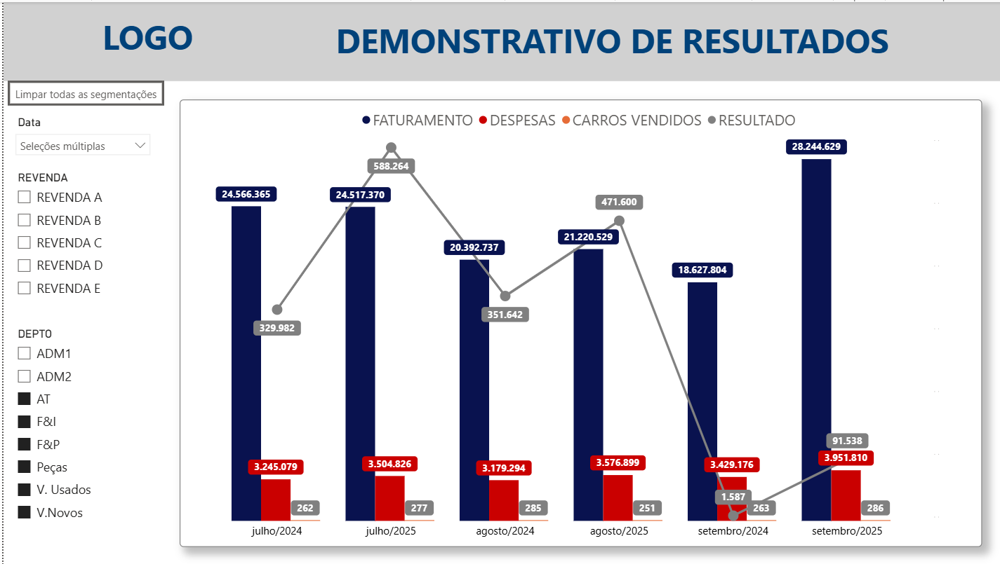
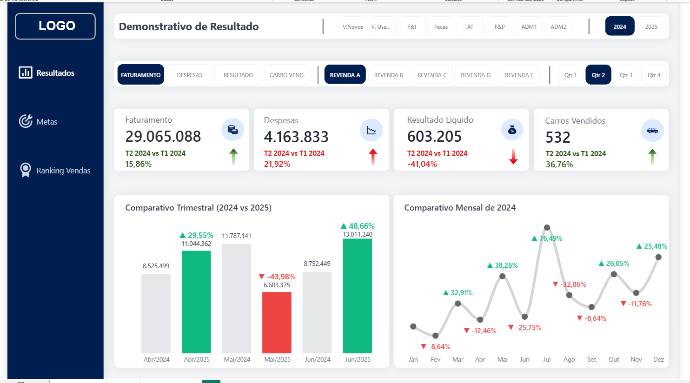
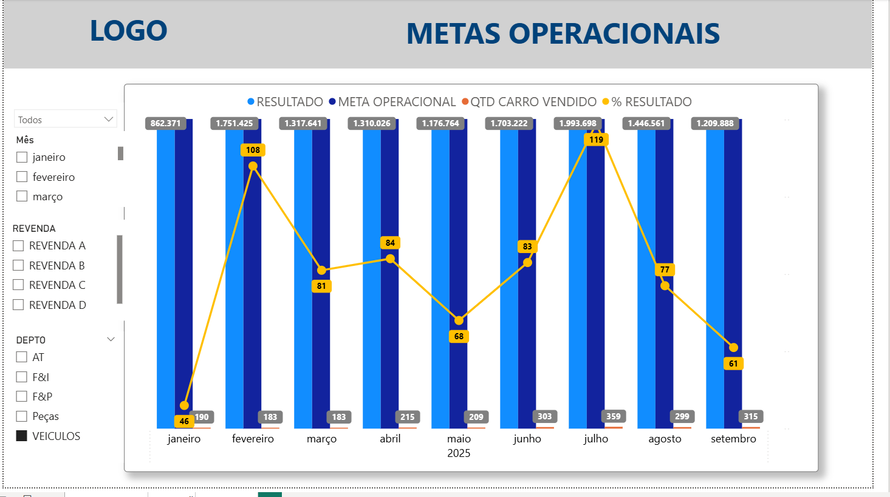
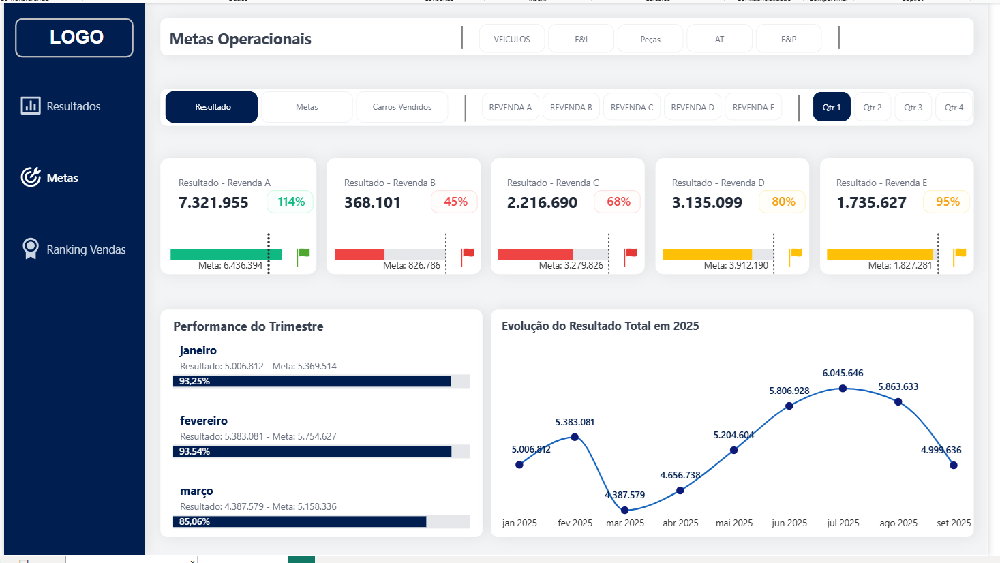
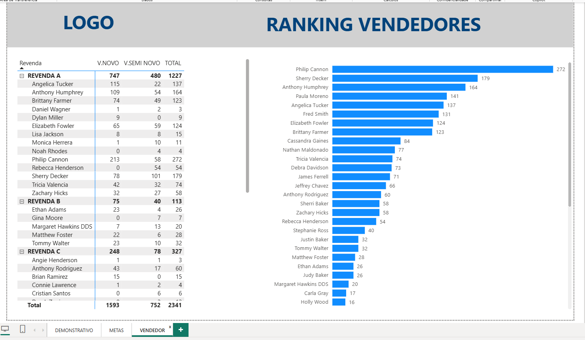
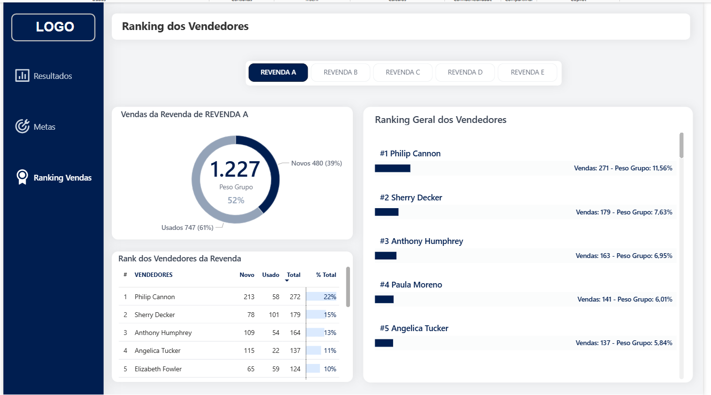

# 🚗 Dashboard Executivo de Vendas & Resultados


> *Redesign completo de relatórios gerenciais focado em UX (Experiência do Usuário) e tomada de decisão rápida.*

---

## 📌 O Que é Este Projeto?
Este projeto consiste na **remodelagem visual e estratégica** dos relatórios de uma rede de concessionárias. O cliente possuía os dados, mas os relatórios antigos eram poluídos, dificultando a identificação de tendências e gargalos.

A missão foi aplicar conceitos de **Data Storytelling**: transformar planilhas e gráficos em uma interface limpa, onde o diretor bate o olho e sabe se a empresa está lucrando ou não.

---

## 📉 Antes e Depois (A Transformação)

O foco do trabalho foi resolver três problemas principais: **Poluição Visual, Falta de Contexto e Dificuldade de Comparação.**

### 1. Demonstrativo de Resultados (DRE)
* **O Problema (Antes):** O relatório original tentava mostrar tudo em um único gráfico (Faturamento, Quantidade e Resultado), misturando eixos e escalas diferentes. Era impossível saber se a margem de lucro estava saudável sem gastar minutos analisando.
* **Solução (Depois):** Foram incluídos **KPIs (Big Numbers)** no topo, com **indicadores de tendência** comparados ao trimestre anterior (setas verdes e vermelhas em GIF para facilitar a interpretação). O gráfico principal foi simplificado para destacar apenas a **evolução mês a mês** e a **comparação com os mesmos meses do ano anterior**.

| Antes (Eixos Confusos) | Depois (Clareza e Contexto) |
| :---: | :---: |
|  |  |

### 2. Controle de Metas Operacionais
* **O Problema (Antes):** Gráficos de barras padrão que ocupavam muito espaço e utilizavam cores sem significado estratégico. Não ficava claro quais filiais estavam abaixo da meta crítica.
* **A Solução (Depois):** Aplicação de **Gestão por Exceção**, onde as cores passam a ter propósito claro: vermelho para metas não atingidas, amarelo para desempenho entre 80% a 99% e verde para metas alcançadas. O visual foi simplificado para barras de progresso, permitindo uma leitura rápida do percentual atingido.

| Antes (Poluição Visual) | Depois (Foco no Resultado) |
| :---: | :---: |
|  |  |

### 3. Ranking de Vendedores (Performance)
* **O Problema (Antes):** Uma tabela extensa ou gráficos simples que mostravam apenas o volume total, sem revelar o perfil da venda (Carros Novos vs. Seminovos).
* **A Solução (Depois):** Visão 360º da performance.
    * **Gráfico de Rosca:** Permite entender rapidamente o mix de vendas (Novos x Usados), com labels que indicam o peso da performance da revenda ou do vendedor nas vendas totais do grupo.
    * **Ranking Visual:** Gráfico de barras horizontais ordenado, facilitando a identificação dos “Top Performers” e permitindo comparações justas entre vendedores. Utiliza o DAX `ALL` para criar um ranking geral (Todo o Grupo).
    * **Tabela Ranking:** Exibe o desempenho de cada vendedor filtrado pela revenda, mostrando a quantidade de carros vendidos e o peso da performance nas vendas totais da própria revenda.

| Antes (Tabela Estática) | Depois (Análise de Perfil) |
| :---: | :---: |
|  |  |

---

## 🛠 Ferramentas e Técnicas

### Visualização e UX (Power BI)
* **Neumorfismo e Design Limpo:** Interface moderna que reduz a carga cognitiva. O usuário foca apenas no dado que importa.
* **Navegação de App:** Uso de botões e menus laterais para simular a experiência de um aplicativo, fugindo do visual de "slide de PowerPoint".
* **Fórmulas DAX:**
    * Cálculos de inteligência de tempo para comparar Trimestre Atual vs. Trimestre Anterior.
    * Medidas de formatação condicional definindo as cores dos alertas (Vermelho/Verde).
    * Uso de animações leves (GIFs) para indicar melhora ou piora nos resultados.

### Tratamento de Dados e LGPD (Python)
Como este é um portfólio público, a segurança dos dados do cliente é prioritária. Utilizei **Python (Pandas e Faker)** para anonimizar a base original antes de subir para o GitHub:
* **Nomes Fictícios:** Vendedores reais foram substituídos por nomes gerados pela biblioteca `Faker` (nomes americanos para descaracterização total).
* **Valores Simulados:** Os valores de venda foram multiplicados por fatores aleatórios (entre 1.10 e 1.99), preservando a tendência das curvas, mas mascarando o faturamento real da empresa.
* **Anonimização Estrutural:** Filiais renomeadas para "Revenda A, B, C".

---

## 📂 Arquivos do Projeto
```text
├── assets/              # Prints comparativos (Antes x Depois)
├── data/                # Base de dados anonimizada (CSV)
├── scripts/             # Script Python utilizado para mascarar os dados
├── relatorio.pbix       # Arquivo do Power BI, redesenhado
├── old_relatorio.pbix   # Arquivo do Power BI, antigo
└── README.md            # Documentação
